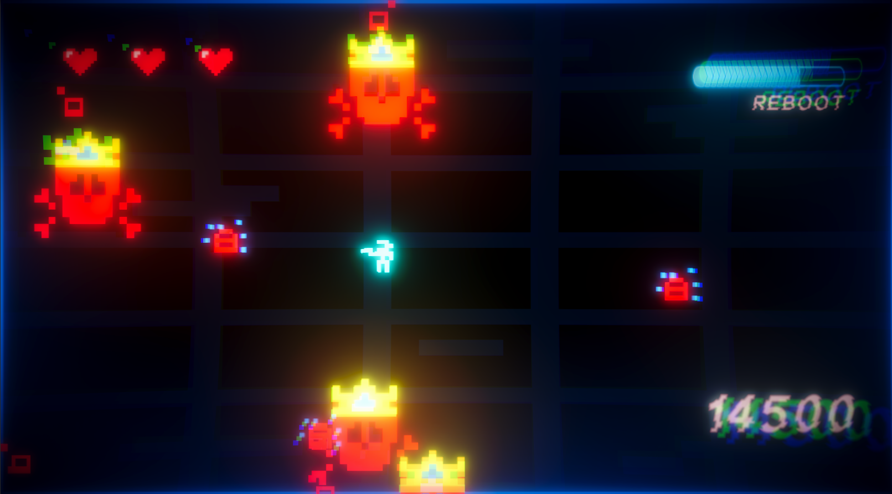
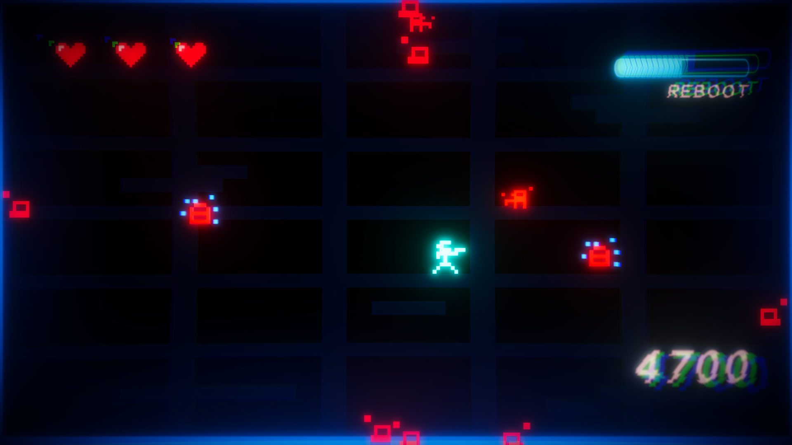

# 🔁 System Reboot

**System Reboot**, 2D top-down aksiyon türünde, dalga tabanlı bir hayatta kalma oyunudur. Oyuncu, düşman dalgalarına karşı mücadele ederken sistemi yeniden başlatmak için ilerler. Basit ama heyecanlı mekanikler ve dinamik ses sistemi ile eğlenceli bir deneyim sunar.

Ek Bilgi:
 Oyundaki karakterleri,arka planı gibi spriteleri Piskel yardımıyla sıfırdan kendim yaptım.
---

## 🎮 Oynanış Özellikleri

- 👾 **Dalga Sistemi:** Her dalga artan zorlukta düşmanlar gönderilir.  
- 🔫 **Atış Mekaniği:** Oyuncu, mermi kullanarak düşmanları yok eder.  
- 💓 **Üç Can:** Oyuncunun sadece bir canı vardır, dikkatli olmalı!  
- ❤️ **Can Sandıkları:** Haritada belirli noktalarda can sandıkları bulunur, canını artırabilirsin.  
- 🔉 **Dinamik Ses:** Menüde arka plan müziğinin pitch’i yavaşlatılır, oyun başladığında müzik normale döner.  
- 🏆 **Kazanç Ekranı:** Dalga tamamlandığında skor ve öldürülen düşman sayısı gösterilir.  
- ⏸️ **Oyun Durdurma:** Kazanma veya kaybetme anında oyun durur, ilgili panel gösterilir.

---

## 🛠️ Teknolojiler ve Araçlar

- Unity (2021.3 LTS veya üzeri önerilir)  
- C# Programlama Dili  
- Unity Animator (Animasyonlar için)  
- Unity UI Sistemi (Butonlar, Paneller)  
- Audio Source (Müzik ve Ses Efektleri)  

---

## 🎨 Görseller







---

## 📩 İletişim

Projeyle ilgili her türlü soru, geri bildirim veya iş birliği için iletişime geçmekten çekinmeyin!

---

**Teşekkürler!** 🙏  

## 🚀 Kurulum ve Çalıştırma

1. Depoyu klonla:
   ```bash
   git clone https://github.com/kullaniciadi/system-reboot.git

